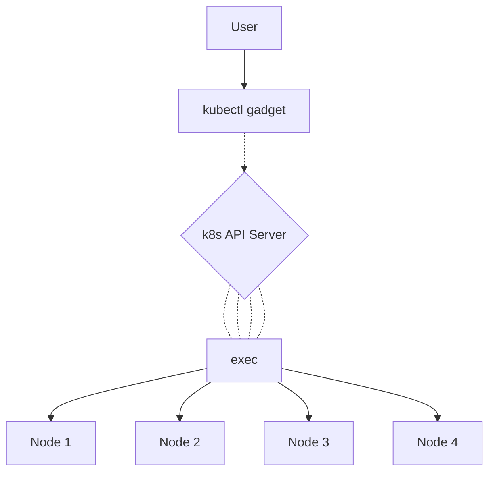
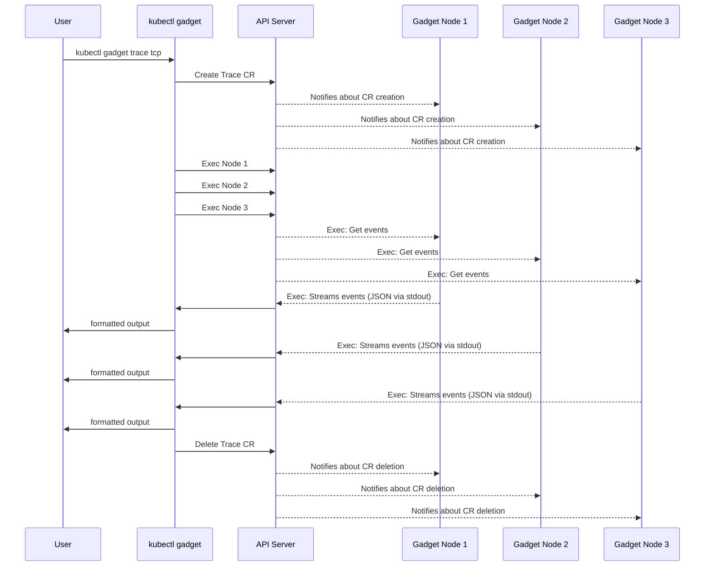
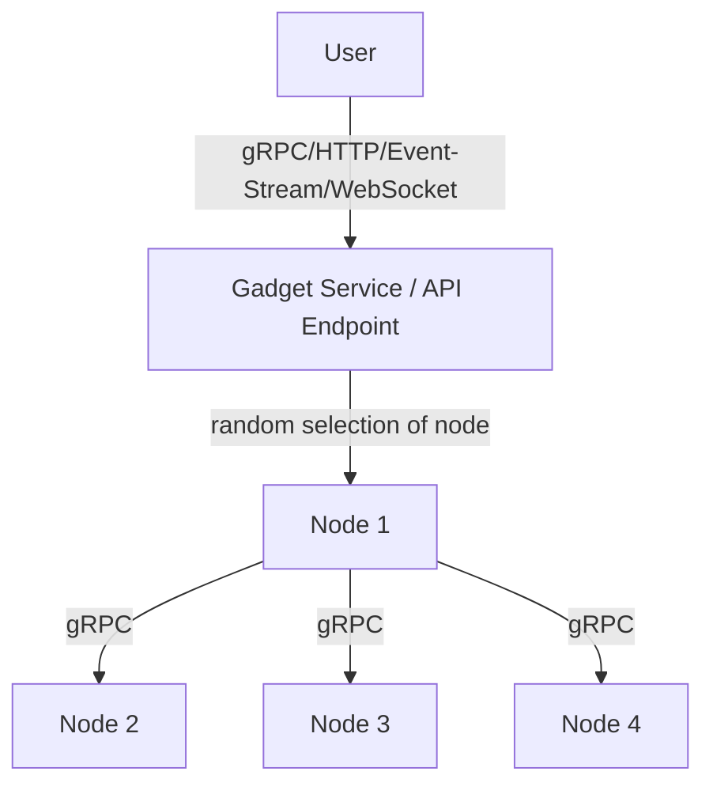
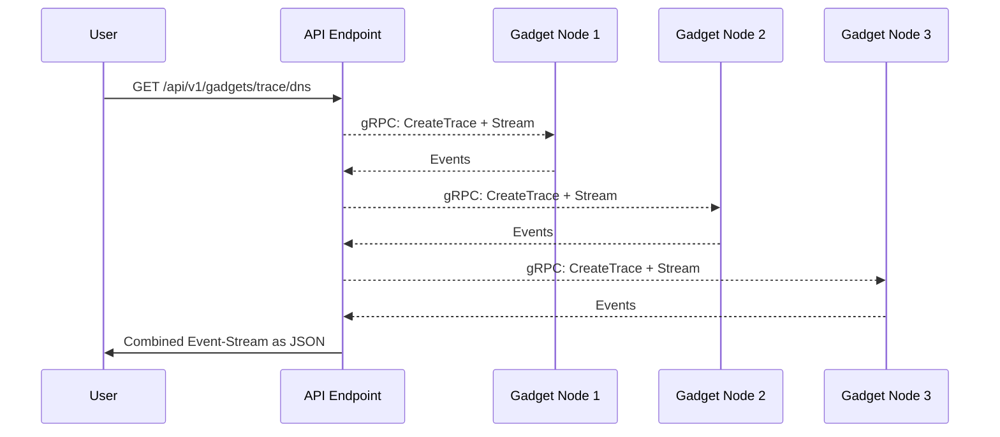
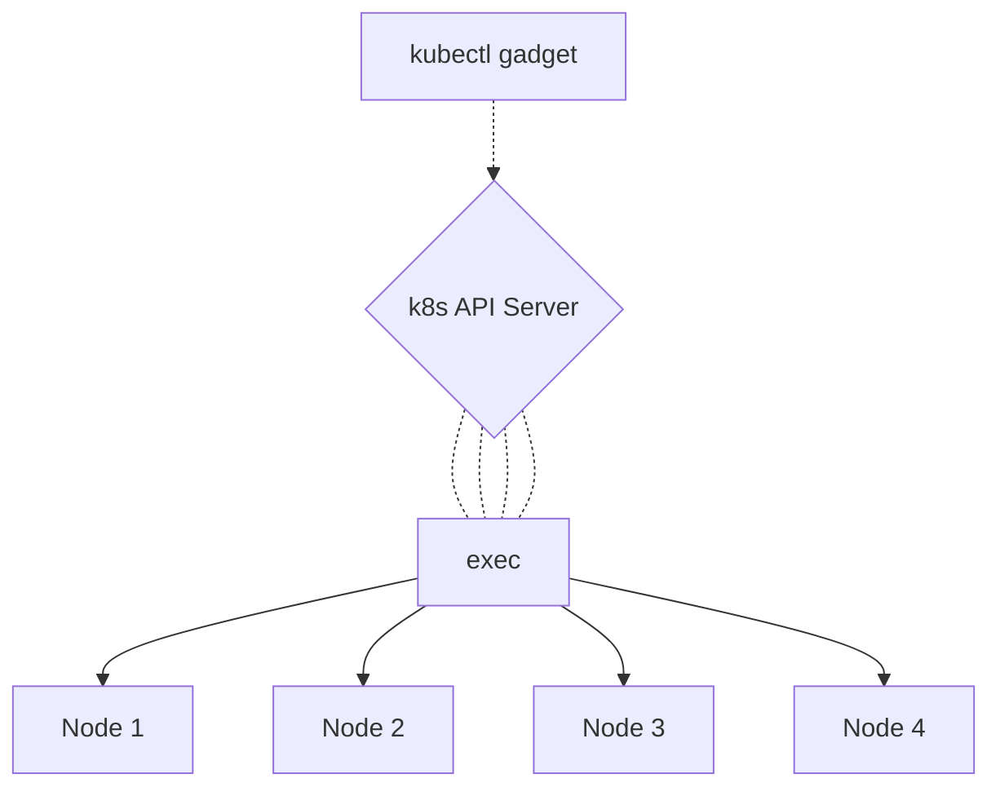
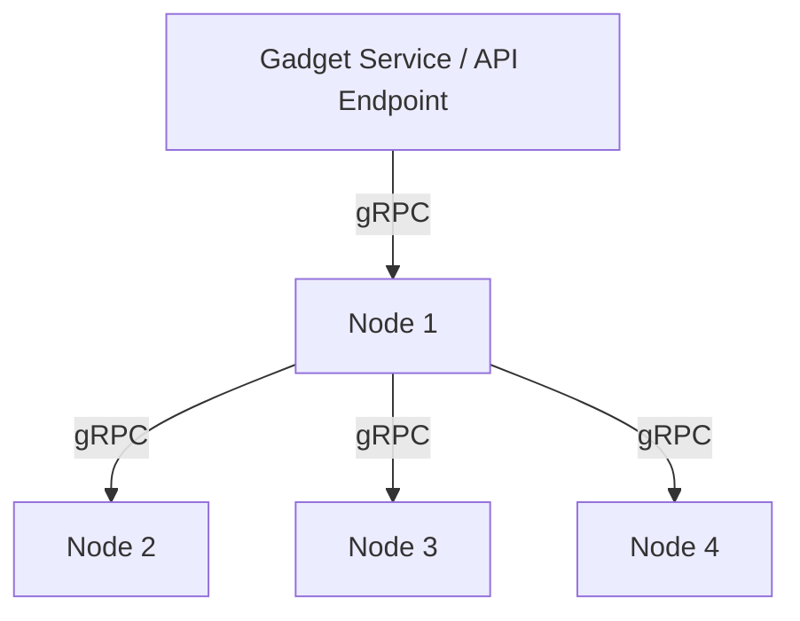

# Transports & API Design Document

## Current Situation

Right now, users can access the gadgets using `kubectl gadget`, `local-gadget` or using the go packages in a custom
project. Let's focus on the most common use case, which is using Inspektor Gadget inside a kubernetes cluster using the
`kubectl gadget` command.

When running the command, kubectl will contact the k8s API Server and deploy a custom resource that gets read by the
gadget tracer managers on their respective nodes. These will then run the gadget and collector or stream their output.
In the latter case, `kubectl` will exec a process on each gadget pod to fetch the stream. 



The whole process is working fine but rather complex if you want to integrate it into other services or products. You'd
have to write code to deploy the CR, enter the pods (through the API server) and parse the output.

The current solution might also significantly increase load on the API server, as it is the single point that all
traffic has to go through.



> Solid lines represent what a user currently would have to implement to use streaming gadgets in the distributed way
> (when not using kubectl gadget).

## Goal

We want to be able to use the gadgets using simple APIs. For example a `curl` command requesting
`/api/v1/gadgets/trace/dns` should return the stream of dns events from all nodes as an `Event-Stream`.
A call to `/api/v1/gadgets/snapshot/socket` should return a JSON object containing the snapshot from all nodes, while a
call to `/api/v1/gadgets/top/ebpf?nodes=mynode01&sort=cumulruntime&timeout=60000` should only return the results from the
top gadgets of node `mynode01`, sorted by the cumulative runtime over 60 seconds. Using these simple protocols, it's
much easier for third parties to integrate Inspektor Gadget into existing tools.

Using the CRD should become optional (in most cases using the APIs documented here, they will not be used).



> Using the gRPC transport 

Regardless of which API the user chooses to use, the complexity of contacting all nodes should by default be hidden.



> Example using Event-Stream (https://www.w3schools.com/html/html5_serversentevents.asp) API. Solid lines again
> represent what a user would have to implement to use gadgets in the distributed way.

## Simplifying the API

### Defining a "Trace"

Right now, the base of a trace configuration is the CRD. We actually simplify already using the `TraceConfig` struct,
but this can be further simplified. Here's what we need for ALL gadgets:

* gadget name
* nodes on which the gadgets should run

All other parameters are more or less gadget specific, so we can just store them in a simple key/value map that gets
forwarded to the gadgets.

### Creating more endpoints, enabling other protocols

To be able to enable more users and projects to take advantage of Inspektor Gadget and its gadgets, we should
create more APIs using common and widely supported standards. This document proposes adding support for

* gRPC as transport and API layer
* HTTP/JSON API for all gadgets
* Event-Stream API for streaming gadgets
* WebSocket API for all gadgets

### Optimizing Transport

In addition to just supporting other means to use the gadgets, this document also proposes a new transport layer that
helps users to deal with the distributed nature of Inspektor Gadget. The user can choose to use the gadgets

* by contacting each node through the API server (like it is done right now)
* by contacting a single node through the API server (that then connects to other involved nodes)
* directly using an exposed gRPC endpoint
* directly using an exposed HTTP/JSON / Event-Stream / WebSocket API
* through a service (that then connects to involved nodes)

The transport should be designed pluggable, so that there's no need for much dedicated code for each of the use cases
listed.

Which transports are supported can be controlled using parameters in the DaemonSet.

#### Transport Interface

The generic transport interface looks like this:

```
type Transport interface {  
   CreateTrace(ctx context.Context, traceConfig *TraceConfig, traceOptions ...Option) (Trace, error)
}

type Trace interface {  
   GetNextEvent() (Event, error)  
}

type Event interface {  
   GetPayload() []byte   // either JSON or another gRPC encoded message
   GetNode() string      // source of the message
   GetType() int         // Type could indicate errors
}
```

The transport interface supports the very basic functionality of retrieving a stream of events from nodes.
`GetNextEvent()` can be called until EOF or the context has been cancelled. The context also defines the lifetime
of the gadgets involved. Depending on the transport implementation (see below), this means deletion of the CR or just
stopping the gadgets directly.

##### Exec Transport implementation (Legacy)

To give an example, here's what the currently used transport (ExecTransport) would do in case of streaming gadgets:

* builds Trace CR from traceConfig
* installs CR
* execs into each pods and fetches JSON encoded streams
* deletes CR once context has been cancelled 



##### gRPC Transport

This is a new transport that will:

* create the gadget, if addressed to this node
* connect to other nodes mentioned in the traceConfig, if `fanout == true` (a parameter of traceConfig)
* forward the traceConfig (with `fanout` set to `false`) and
* retrieve local and remote event streams (payload can be either JSON or protobuf encoded)
* forwarding them back to the client


> Scenario with `fanout == true`

No CR is involved in general, although support for that could be added as "admission token" (see below).

Cancelling the context will also cancel all subsequently used contexts (when the transport forwarded requests to other
nodes).

The gRPC transport can be used either through the k8s API Server (using PortForward) or an exposed service.

###### gRPC Messages/Service (protobuf)

```
message TraceConfig {
  string gadget = 1;
  repeated string nodes = 2;
  map<string,string> params = 3;
  bool fanOut = 4;
}

message TraceEvent {
  string traceID = 1;
  string line = 2;
  uint32 type = 3;
  string node = 4;
  int64 timestamp = 5;
  uint32 flags = 6;
}

service Gadget {
  rpc StreamTrace(TraceConfig) returns (stream TraceEvent);
  rpc Snapshot(...) returns (...);
  ...
}
```

## Examples

### Local Web API (optionally with minimalistic Web Frontend) using ExecTransport

Running `kubectl gadget web` will create a local http endpoint that is plugged into the ExecTransport. It converts
a call to e.g. `/api/v1/gadgets/trace/dns` to a `CreateTrace()` call on the ExecTransport, which will create the CR,
exec into the pods and forwards the stream, so it can be retrieved with `GetNextEvent()`.

### Web API as Service

When the optional web API is enabled in the DaemonSet, it will expose HTTP endpoints that can be used either through the
k8s API Server (using PortForward) or an exposed service. This is plugged into the gRPC transport that then handles
and/or forwards requests according to the traceConfig.

## Remarks

### Authentication / "Admission Tokens"

When exposing services, we need to add some kind of authentication/authorization, as we can't rely on the API server in
these cases. This could be either done through kubernetes secrets or through "admission tokens" - basically deployed
CRs for traces that have a unique ID and whose results can subsequently be fetched by calling something like
`/api/v1/gadgets/trace/dns?crID=SECRETID` - which in turn makes the backend lookup the CR and run the gadget with the
configuration given in there.

## Technical / Implementation Details

### Bridges

A bridge s similar to the parser right now, only that it tries to knows less. It ingests raw JSON events (from a
Transport, see above - maybe protobuf later on) and returns it in a well known format instead of gadget specific
structs - example: json in => json out. What happens in between, will stay inside the bridge - like for example
filtering, sorting, enriching etc. It exposes the simple logic by a `Converter` interface. GetSpecAsJSON() in this case
returns the Columns information encoded as JSON.

```
type Converter interface {  
   FormatJSON(data []byte) ([]byte, bool, error)  
   GetSpecAsJSON() []byte  
}
```

### Building a Web Backend

We should support different types of endpoints, some depending on the gadget type:

* JSON call to get info on gadgets / columns (basically an automated interface description for frontends)
* JSON endpoints for one-off or timed gadgets
* WebSocket and/or Event-Stream endpoints for streaming gadgets

The simplest web backend would look something like this:

```
type Server struct {  
   gadgetTransport interfaces.Transport  
   gadgets         map[string]*gadget  
}  
  
type gadget struct {  
   name       string  
   gadgetType string  
   converter  bridge.Converter  
}
```

Gadgets are registered in a map with their name, and we register the appropriate Transport (which is the `ExecTransport`
right now, as the web interface in this example is run on the client using `kubectl gadget web`).

For streaming gadgets, we now have a route `http://..../api/v1/trace/:gadgetName?pod=abcdef`. Whenever this is called,
we look up the gadget in the map and create a traceConfig (see above) with the parameters filled in from URL parameters.
We hand that over to the transport by calling CreateTrace() using the context of the incoming http request. The events
that we can get from the trace will directly be handed to the `bridge.Converter` of the registered gadget and the
output streamed to the http connection.

## Roadmap / PoCs done

* [X] define transport interface
* [X] implement ExecTransport
* [X] implement basic HTTP endpoint (Event-Stream)
* [X] implement gRPCTransport with FanOut mechanism
* [X] implement forwarding requests to gRPC from `kubectl gadget` to use gRPCTransport
* [ ] add authentication
* [ ] move all structs to protobuf
* [ ] document API using OpenAPI
